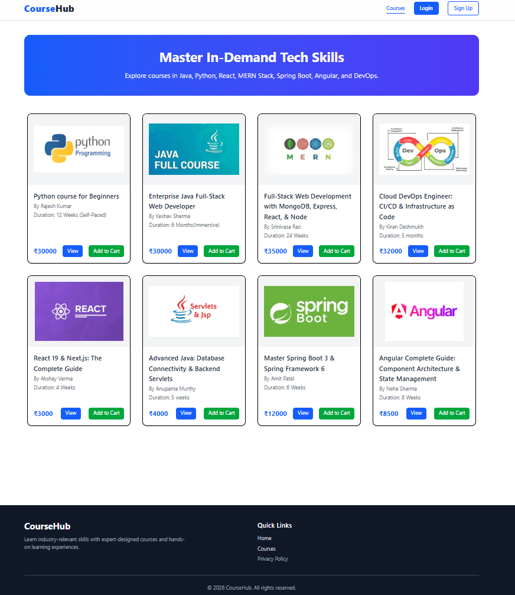
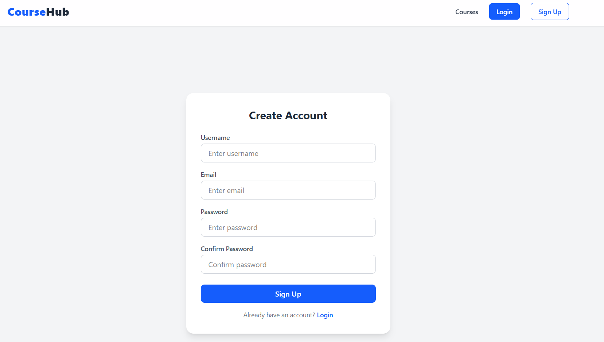
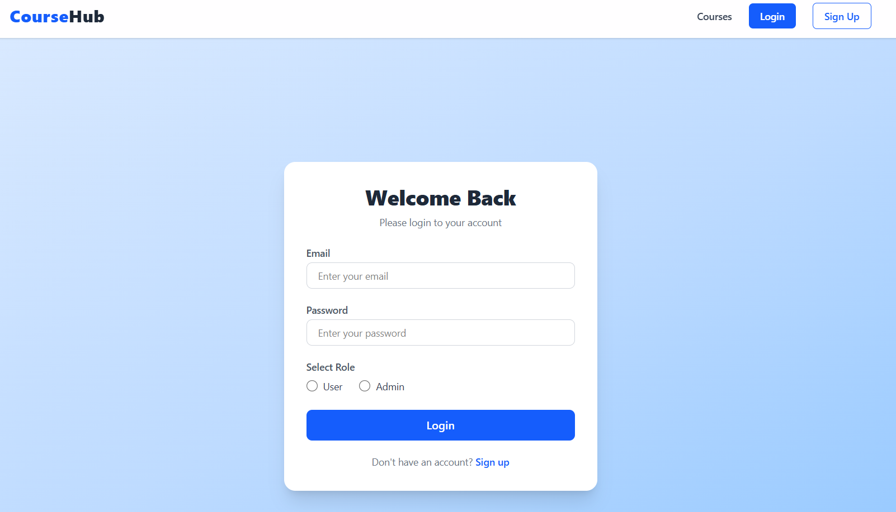
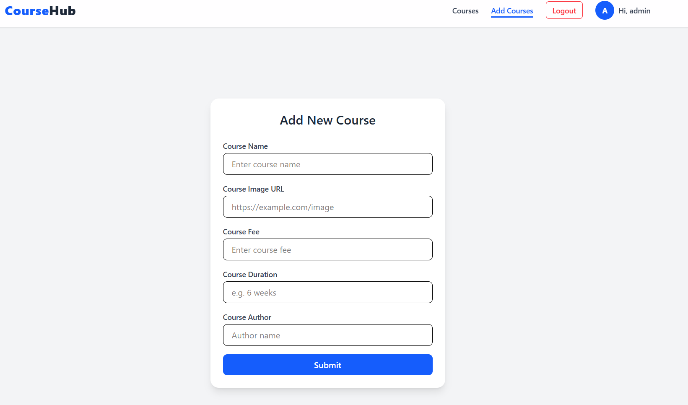
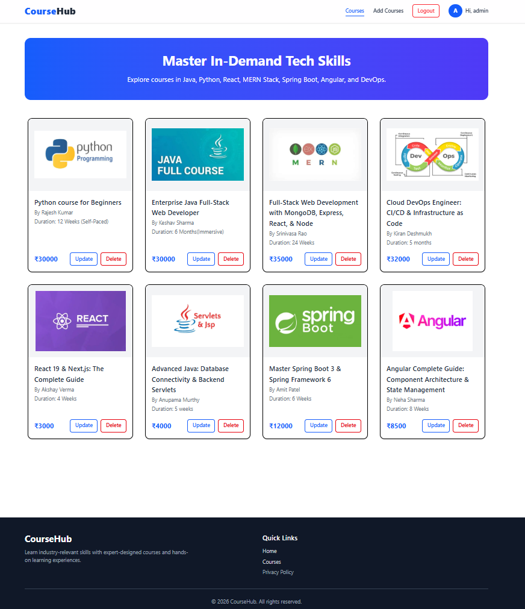
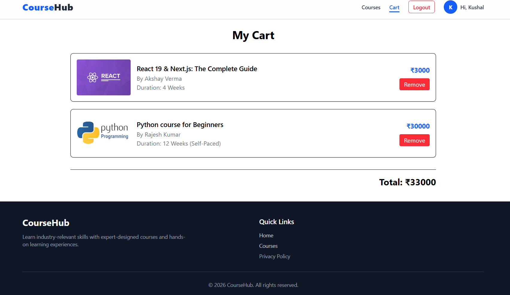
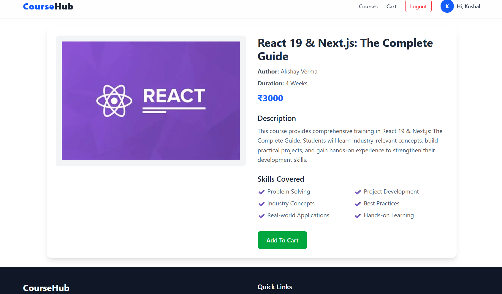
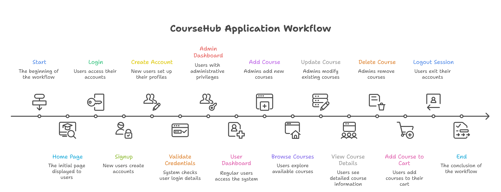

# CourseHub – React Course Management Application
> A modern React-based course management platform with authentication, cart functionality, and admin course management features.

CourseHub is a modern and responsive course management web application built using React.js, Vite, Tailwind CSS, Context API, and JSON Server.

The application provides a complete course browsing and management experience where users can register, login, explore available courses, and add courses to their cart. It also includes role-based authentication that allows admin users to manage the platform by adding, updating, and deleting courses.

The project focuses on implementing core frontend development concepts such as component-based architecture, routing, protected routes, state management using Context API, API integration with Axios, local storage authentication, and responsive UI design using Tailwind CSS.

---

## Live Demo
Coming Soon - Deployment In Progress

---

## Project Screenshots

### Home Page


### SignUp Page


### Login Page


### Add-Course Page


### AdminDashboard Page


### Cart Page


### Course Details Page


---

# Features

## Authentication
- User Signup
- User Login
- Role-based Authentication (Admin/User)
- Protected Routes
- Persistent Login using LocalStorage

## Course Management
- View All Courses
- Add New Course (Admin)
- Update Existing Course (Admin)
- Delete Course (Admin)

## Cart Functionality
- Add Courses to Cart
- View Cart Items
- Remove Courses from Cart
- Calculate Total Cart Price

## UI Features
- Responsive Navbar
- Modern Course Cards
- Sticky Navigation Bar
- Footer Section
- Tailwind CSS Styling

---

## Key Concepts Used

- React Hooks (useState, useEffect, useContext)
- Context API state management
- CRUD operations using Axios
- Client-side routing with React Router
- Role-based authentication
- Protected routes implementation
- LocalStorage session persistence
- REST API handling using JSON Server

---

## Tech Stack

| Category | Technology |
|-----------|------------|
| Frontend | React.js |
| Build Tool | Vite |
| Styling | Tailwind CSS |
| Routing | React Router DOM |
| State Management | Context API |
| HTTP Client | Axios |
| Notifications | React Hot Toast |
| Backend Mock API | JSON Server |

---

# Project Structure
```txt
course-management-react-application/
│
├── assets/
│   ├── addcoursepage.png
│   ├── admindashboard.png
│   ├── cart.png
│   ├── course-details.png
│   ├── flowchart.png
│   ├── homepage.png
│   ├── login.png
│   └── signup.png
│
├── backend/
│   └── db.json
│ 
├── public/
│
├── src/
│   ├── App.jsx
│   ├── App.css
│   ├── main.jsx
│   │ 
│   ├── components/
│   │   ├── Navbar.jsx
│   │   └── Footer.jsx
│   │  
│   ├── context/
│   │   ├── AuthContext.jsx
│   │   └── CartContext.jsx
│   │ 
│   ├── pages/
│   │   ├── AddCourse.jsx
│   │   ├── Cart.jsx
│   │   ├── Course.jsx
│   │   ├── CourseList.jsx
│   │   ├── Layout.jsx
│   │   ├── Login.jsx
│   │   ├── Signup.jsx
│   │   └── UpdateCourse.jsx
│   │ 
│   └── route/
│       ├── AdminRoute.jsx
│       ├── ProtectedRoutes.jsx
│       └── UserRoute.jsx
│
├── package.json
├── README.md
└── vite.config.js
```

---

## Application Flowchart



---

## Application Workflow

1. Users can register through the Signup page and create an account.
2. Registered users can log in using their credentials.
3. The application validates user credentials and determines the user role.
4. Admin users can manage courses by adding, updating, and deleting course information.
5. Regular users can browse available courses, view course details, and add courses to their cart.
6. Cart items are maintained separately for each user.
7. Role-based routing ensures that only authorized users can access specific pages.
8. Users can log out securely, ending their session.

---

## Installation/Setup

1. Clone the repository

```bash
git clone <your-github-repo-link>
```

2. Navigate to the project folder

```bash
cd course-management-react-application
```

3. Install dependencies

```bash
npm install
```

4. Start JSON Server

```bash
npx json-server --watch backend/db.json --port 3000
```

5. Open a new terminal and start React

```bash
npm run dev
```

---

# Demo Credentials

## Admin Login
- Email: admin@gmail.com
- Password: admin@123
- Role: admin

## User Login
- Email: a@gmail.com
- Password: a@123
- Role: user

---

## Project Highlights

- Role-Based Authentication (Admin/User)
- Protected Routes
- Course CRUD Operations
- Shopping Cart Functionality
- Context API State Management
- JSON Server Mock Backend
- Responsive Design with Tailwind CSS

---

## Future Improvements

- Course search and filtering
- Pagination support
- Wishlist functionality
- Payment gateway integration
- JWT Authentication
- Spring Boot backend integration
- MySQL database integration
- Deployment using Vercel/Netlify

---


